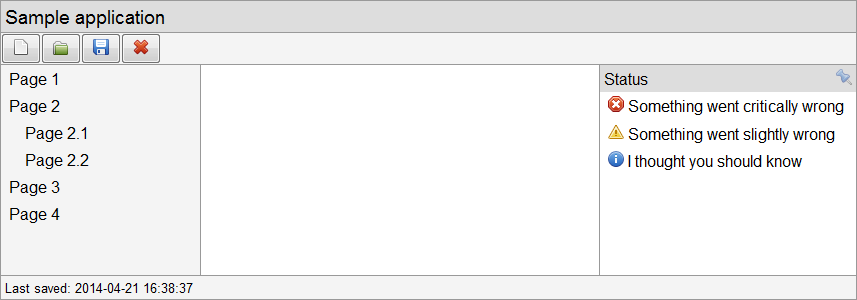

calcGrid
========

This is a little experiment with the CSS ```calc()``` function to produce a grid layout system (yes, I know, yet another one!) similar in principle to that of the WPF grid layout.

It's targeted at application layouts, using both column and row sizes. For example the following layout is very straightforward:



Usage
-----

Include the small JavaScript and CSS files in your page

```html
<link type="text/css" rel="stylesheet" href="calcGrid.css"/>
<script type="text/javascript" src="calcGrid.js"></script>
``` 

In your html create your grid

```html
<div class="grid" data-row-sizes="50px, 1rel" data-col-sizes="1rel, 3rel">
    <div data-row-start="0" data-col-start="0"></div>
    <div data-row-start="0" data-col-start="1"></div>
    <div data-row-start="1" data-col-start="0" data-col-end="1"></div>
</div>
```

Then bootstrap it in JavaScript

```js
calcGrid.init();
```

You can also dynamically build up the grid entirely in JavaScript, see [the examples](examples/) for more details.

Notes
-----

Items in the grid can span multiple rows and columns, just specify a ```data-row-end``` and/or ```data-col-end``` attributes.

The ```data-row-sizes```/```data-col-sizes``` attributes are a comma separated list of sizes. Each value can be any valid CSS length, and you can mix units across different rows/columns. You can also use things that are valid inside a ```calc()``` e.g. ```20% + 10px / 2```.

There is a special unit ```rel``` which is analogous to the WPF '```*```' size; row/column sizes specified with this unit will fill up remaining space in the specified proportion relative to other ```rel``` sized rows/columns.  Sizes specified in ```rel``` cannot be included in calculations, e.g. the following will not work: ```20px + 1rel```.

Browser Support
---------------
Tested to work in IE9+, Chrome and Firefox.

Note, if you don't need to support IE9 I'd recommend just using *flexbox* instead.

Inspirations
------------
[http://www.sitepoint.com/creative-grid-system-sass-calc/](http://www.sitepoint.com/creative-grid-system-sass-calc/ "A Creative Grid System With Sass and calc()")

TODOs
-----
* Dynamic resizing, as is possible in WPF with the ```GridSplitter```.
